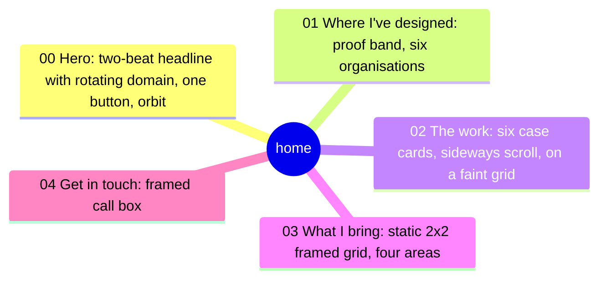
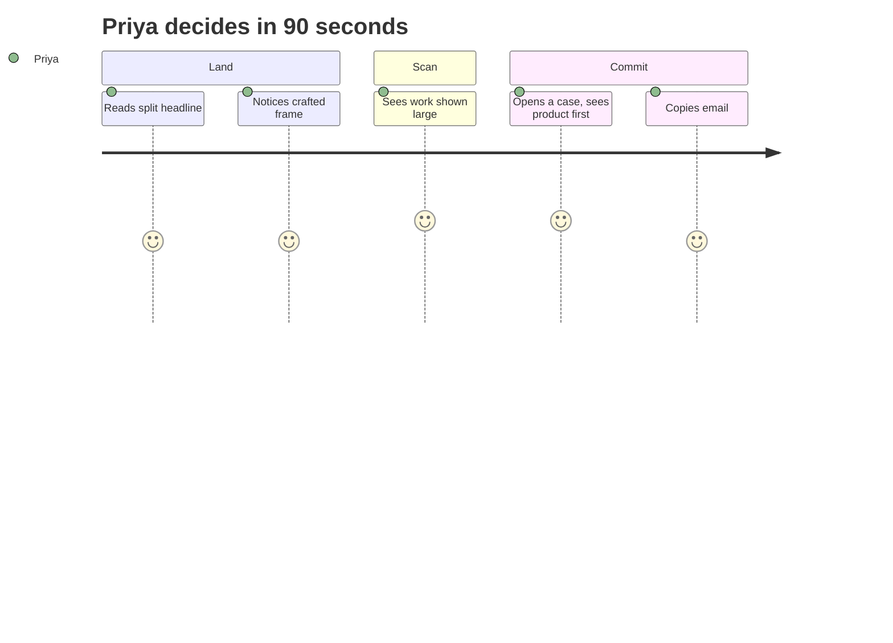

# EXPERIENCE.md

## Foundation
- Form factor: web, desktop-first for hiring managers, fully responsive.
- Stack: Next.js App Router, CSS modules, tokens from tokens/tokens.json. No Tailwind.
- Visual identity lives in DESIGN.md and is referenced as `{path.to.token}`.
- **Spines win on conflict.** Any mock, Stitch output or Taste Skill suggestion loses to these two files.

## Information Architecture
Home follows Deploy's order, with the work moved up; the reframe and "What changed" sections are gone:

/resume and /colophon keep their structure and pick up the tokens. URLs and slugs do not change.

Case study pages are moving, one study at a time, from the five beats (Frame, Stakes, Decisions, Outcome, Ownership) to a story layout: hero and summary unchanged, then numbered chapters with a plain first-person heading, paragraphs, and the study's diagrams and screens placed between the paragraphs where the story needs them. The side rail lists the chapters. A study opts in with `story` in its content; studies without it keep the beats. All six studies are converted (2026-10-10).

## Voice and Tone
Home: short and confident. Headlines in two beats: the claim, then the turn.
Everywhere: Ali's own voice, first person, the way he'd explain it to a colleague. Medium-length sentences joined with "and", "but", "so"; contractions; plain words. No arrows or dash ranges in prose ("from 9 steps to 5", not "9 → 5"), no buzzwords, no clipped slogan lines, no "not X, it's Y" formula. Copy is checked against the human-story-writer skill. No em dashes. No client names.

## Component Patterns
| Component | Behaviour |
|---|---|
| Split headline | Line two reveals after line one on first view; static under reduced motion. |
| Case cards | Sideways scroll with snap; arrow buttons step one card; the whole card is the link. |
| Orbit | Decorative and aria-hidden; spins at 60s per turn, still under reduced motion. |
| Capability grid (What I bring) | Four areas (Domain, Systems, People, AI) in one framed 2x2 grid with hairlines and crosshair corners, like the proof list. Each cell: index and tag, a small frameless line glyph, title, accent one-liner, points, and case-study chips pinned to the foot of the cell so a row lines up. All four visible at once: no pinning, no scroll-driven motion. One column under 860px. |
| Rotating word | Changes every 4s with a fade and small rise (old out, then new in); fixed width; the full sentence is in the h1 for screen readers; static under reduced motion. |
| Compare table | A real table: brief said vs what I found; row headers link to each case. |
| Eyebrow index | Section numbers match order on the page; not interactive. |
| Nav | Floating pill; Work, Contact, Resume; theme toggle kept. |

## State Patterns
Static site, so states are limited: image loading (reserve panel aspect ratio, no layout shift), video autoplay off under reduced motion, theme toggle remembers choice.

## Interaction Primitives
Motion budget: medium. Reveal on scroll for sections, line-two headline reveal, panel parallax at most subtle. Everything respects `prefers-reduced-motion`. Uses existing `motion.enter` and `motion.hover` tokens.

## Accessibility Floor
- Frame lines, crosshairs and ruler are `aria-hidden`.
- Accent on dark must pass 4.5:1 for text; check:contrast runs on every token change.
- Focus ring visible on dark; keyboard order follows visual order.

## Key Flows
[ASSUMPTION] Draft protagonist. Replace with a real one.
1. Priya, Head of Design at a US health-tech company, opens the link from a LinkedIn message between two calls.
2. Hero: in three seconds she reads the split headline and sees a framed, crafted page.
3. She scrolls to 01 Selected work and sees enrollment screens shown large, not thumbnails.
4. **Climax:** she opens one case and the first thing on screen is the designed product, with the reframe as a tight compare table beside it. Designer and business thinker, both visible in one view.
5. She clicks Resume or copies the email.

